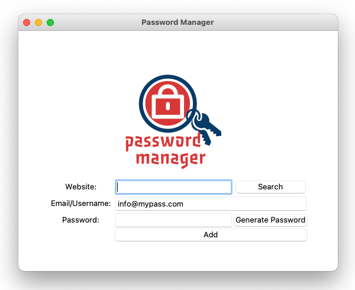

# Password Manager

<!-- TABLE OF CONTENTS -->

  
Table of Contents

  <ol>
    <li>
      <a href="#about-the-project">About the Project</a>
    </li>
    <li><a href="#features">Futures</a></li>
    <li><a href="#usage">Usage</a></li>
    <li><a href="#license">License</a></li>
  </ol>

<!-- ABOUT THE PROJECT -->
## About the Project
Password Manager is a simple password-generating application. The application can 
generate a random password that contains letters, numbers, and symbols. The length of the password 
will randomly vary between 12 and 18 symbols. Users can save their generated username and password in 
the application and search for it later.

The user interface is made with Tkinter and is nothing fancy. I have noted that at the time of writing
this readme file, Tkinter isn't much enjoyable in some function on mac as of on windows. Mac users might
be frustrated sometimes when Tkinter isn't working as expected.

I really can't remember where I did the logo in this app. But I can be sure that it was on an online
logo-creating website. Anyone who wants to quickly generate a logo, please visit our best pal google.

**Repository:** [Password Manager](https://github.com/drliptons/password-manager)

(<a href="#top">back to top</a>)

<!-- FEATURES -->
## Features
___
* Generate random password
* Save password
* Recall saved password
* GUI with tkinter
* Logo

(<a href="#top">back to top</a>)

<!-- USAGE -->
## Usage
___
This project is for education and demonstration purposes. Anyone who is interested in this code is free to use it without any
prior permission.

(<a href="#top">back to top</a>)

<!-- LICENSE -->
## License
___
Distributed under the MIT License. Please see `LICENSE.md`
for further information

(<a href="#top">back to top</a>)

